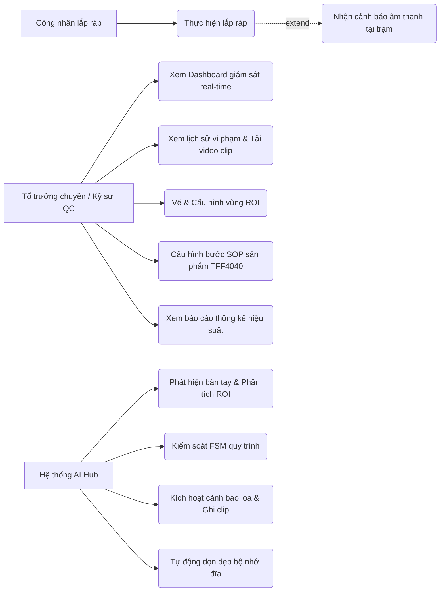
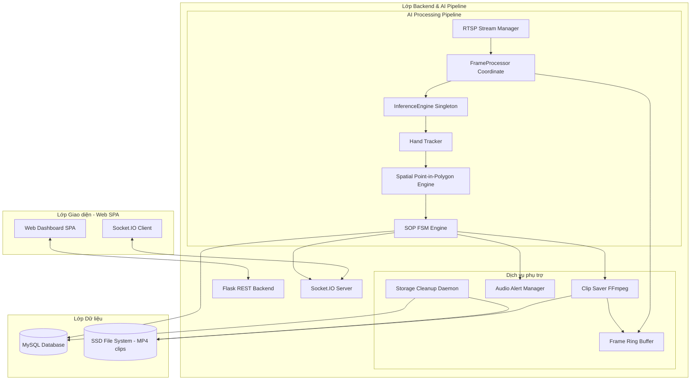
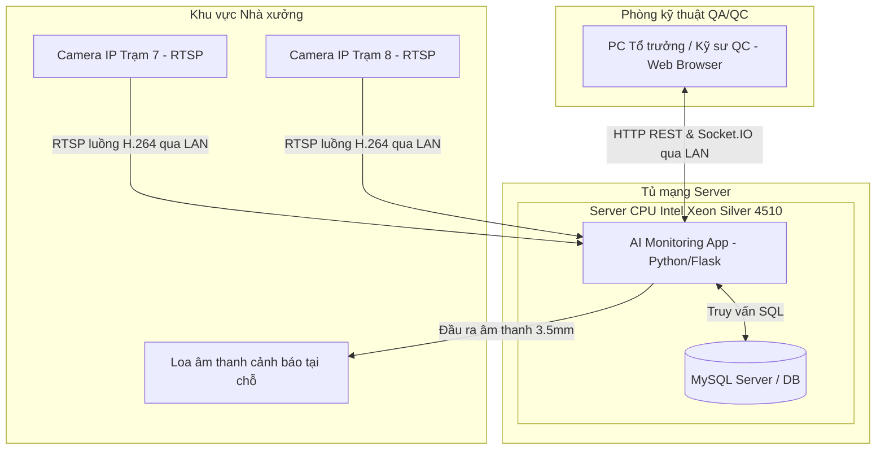
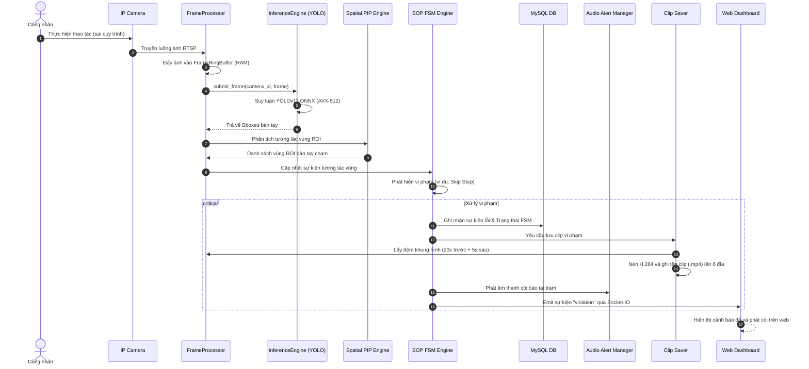
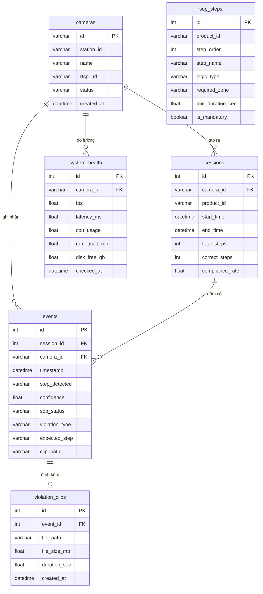

# CHƯƠNG 3: PHÂN TÍCH VÀ THIẾT KẾ HỆ THỐNG

### 3.1 Phân tích yêu cầu hệ thống

#### 3.1.1 Yêu cầu chức năng (Functional Requirements - FR)
Hệ thống được thiết kế để giải quyết bài toán giám sát tuân thủ quy trình SOP tại các trạm lắp ráp. Các chức năng cốt lõi bao gồm:
*   **FR-1: Thu nhận luồng hình ảnh camera:** Kết nối và duy trì luồng ảnh ổn định từ Camera IP thông qua giao thức RTSP.
*   **FR-2: Phát hiện bàn tay thời gian thực:** Định vị chính xác hộp bao bàn tay của công nhân và phân biệt tay Trái/Phải.
*   **FR-3: Phân tích tương tác không gian:** Xác định chính xác khi nào tay công nhân đi vào/ra khỏi các vùng ROI đa giác trên bàn thao tác.
*   **FR-4: Kiểm soát trạng thái SOP:** So khớp chuỗi hành động thực tế với các bước SOP định nghĩa sẵn, phát hiện lỗi bỏ bước (Skip Step), quá thời gian (Timeout), hoặc quay lại bước 1 sớm (Premature Restart).
*   **FR-5: Cảnh báo vi phạm tức thời:** Phát còi hú báo động tại trạm bằng âm thanh và gửi cảnh báo đỏ real-time lên giao diện Web Dashboard khi phát hiện lỗi.
*   **FR-6: Ghi hình sự kiện vi phạm:** Tự động cắt lưu clip ngắn từ 10-30 giây ghi nhận quá trình công nhân thao tác sai để làm bằng chứng đối soát chất lượng.
*   **FR-7: Quản trị cấu hình ROI:** Cho phép kỹ sư vẽ trực quan tọa độ các vùng ROI đa giác trên nền ảnh camera và lưu cấu hình dưới dạng YAML.
*   **FR-8: Thống kê hiệu suất:** Hiển thị trực quan compliance rate (tỷ lệ tuân thủ), số lượng chu kỳ hoàn thành, tần suất các loại lỗi vi phạm theo ca làm việc, ngày, tuần, tháng.

#### 3.1.2 Yêu cầu phi chức năng (Non-functional Requirements - NFR)
Để triển khai thực tế trên môi trường nhà máy, hệ thống phải đáp ứng các tiêu chí phi chức năng nghiêm ngặt:
*   **NFR-1: Tính thời gian thực (Real-time Latency):** Tổng độ trễ từ khi camera bắt khung hình đến khi đưa ra cảnh báo lỗi phải dưới 100ms trên CPU.
*   **NFR-2: Tối ưu tài nguyên CPU:** Chạy mượt mà tần suất 15 FPS/camera, mức độ chiếm dụng CPU của server Xeon 12-core không quá 40% khi chạy song song 3 camera.
*   **NFR-3: Tính sẵn sàng cao và Kháng lỗi:** Tự động kết nối lại camera trong vòng 5 giây sau khi mất kết nối mạng. Sự cố mất kết nối một camera không được làm ảnh hưởng đến các camera ở trạm khác.
*   **NFR-4: Quản lý đĩa thông minh:** Tự động xóa các video clip cũ khi dung lượng ổ cứng SSD vượt quá 85% hoặc dung lượng trống dưới 50GB.
*   **NFR-5: Tính bảo mật:** Dashboard hoạt động trong mạng LAN nội bộ nhà máy, không yêu cầu kết nối Internet bên ngoài.

#### 3.1.3 Sơ đồ Use Case tổng thể
Sơ đồ Use Case mô tả mối quan hệ giữa các tác nhân (Actors) và các chức năng hệ thống:



> **[CHÈN HÌNH 3.1: Ảnh kết xuất đồ thị Use Case Diagram hệ thống từ mã nguồn Mermaid ở trên hoặc bản vẽ thiết kế UML tương đương]**

---

### 3.2 Kiến trúc tổng thể và mô hình triển khai

#### 3.2.1 Kiến trúc 3 lớp (3-Tier Architecture)
Hệ thống được tổ chức thành ba lớp độc lập nhằm đảm bảo khả năng bảo trì và nâng cấp dễ dàng:
1.  **Lớp Presentation (Giao diện người dùng):** Trình bày dữ liệu trực quan bằng nền tảng Web Single Page Application (SPA), sử dụng HTML5, CSS3, Vanilla JS và Socket.IO client.
2.  **Lớp Application Logic (Xử lý nghiệp vụ Backend):**
    *   *AI Pipeline:* Đọc camera RTSP, chạy suy luận ONNX, phân tích Point-in-Polygon.
    *   *SOP Engine:* Máy trạng thái FSM xử lý logic chuyển bước và lỗi.
    *   *Backend Services:* Flask server cung cấp REST API, Socket.IO server phát thông báo real-time, ClipSaver cắt video FFmpeg.
3.  **Lớp Data Access (Cơ sở dữ liệu):** Sử dụng MySQL (hoặc SQLite cấu hình WAL mode) để lưu cấu hình, thông tin phiên làm việc, sự kiện vi phạm và các đường dẫn clip tương ứng.

#### 3.2.2 Sơ đồ thành phần (Component Diagram)



> **[CHÈN HÌNH 3.2: Ảnh kết xuất đồ thị Component Diagram hệ thống từ mã nguồn Mermaid ở trên]**

#### 3.2.3 Sơ đồ triển khai phần cứng (Deployment Diagram)



> **[CHÈN HÌNH 3.3: Ảnh kết xuất đồ thị Deployment Diagram hệ thống từ mã nguồn Mermaid ở trên]**

---

### 3.3 Thiết kế Pipeline xử lý luồng ảnh

#### 3.3.1 RTSP Stream Manager và cơ chế tự kết nối lại (Reconnection)
Lớp `RTSPStreamManager` quản lý việc thu nhận khung hình từ camera IP bằng đa luồng. Một luồng Python chuyên biệt chạy vòng lặp đọc camera để tránh chặn luồng AI:
*   **Tránh nghẽn hàng đợi:** Luồng camera liên tục ghi đè một biến `shared_frame` để luồng AI luôn lấy được khung hình mới nhất, loại bỏ tình trạng tích lũy trễ hình.
*   **Logic tự động phục hồi:** Khi camera mất tín hiệu (hàm `read()` trả về False hoặc ném ngoại lệ), luồng camera sẽ bắt đầu trạng thái Reconnect:
    1. Phát sự kiện `camera_status: error` qua Socket.IO để báo động trên dashboard.
    2. Giải phóng đối tượng `cv2.VideoCapture`.
    3. Đợi 5 giây (retry delay) trước khi thử khởi tạo lại kết nối.
    4. Thử tối đa 10 lần. Nếu kết nối lại thành công, phát sự kiện `camera_status: active`. Nếu quá 10 lần, dừng thử để tránh quá tải CPU và khóa camera trong trạng thái lỗi.

> **[CHÈN CODE 3.1: Đoạn mã nguồn Python của lớp RTSPStreamManager trong file integrations/rtsp_stream.py - phần đọc luồng camera và cơ chế reconnect tự động khi mất tín hiệu]**

#### 3.3.2 Thiết kế InferenceEngine dạng Singleton
Để tối ưu tài nguyên CPU và tránh tranh chấp bộ nhớ đệm, lớp `InferenceEngine` nạp mô hình YOLOv11 ONNX được thiết kế theo mẫu thiết kế **Singleton** (chỉ có duy nhất một thực thể trong toàn bộ hệ thống).
*   **Serialized Inference:** Khi có nhiều luồng camera cùng gửi ảnh yêu cầu suy luận, InferenceEngine sử dụng một khóa `threading.Lock` để xếp hàng và xử lý suy luận tuần tự. Do máy chủ Xeon Silver 4510 có xung nhịp đơn nhân cao và tối ưu AVX-512 tốt, thời gian suy luận chỉ khoảng 35ms, việc chạy tuần tự cho 1-3 camera vẫn đảm bảo tổng FPS hệ thống đạt yêu cầu.

> **[CHÈN CODE 3.2: Đoạn mã nguồn Python của lớp InferenceEngine trong file pipelines/inference_engine.py - cấu hình mô hình ONNX, cơ chế Singleton và khóa tương hỗ threading.Lock khi suy luận]**

#### 3.3.3 Sơ đồ tuần tự tương tác khi xảy ra vi phạm (Sequence Diagram)
Sơ đồ tuần tự sau mô tả chi tiết luồng dữ liệu từ lúc Camera thu nhận ảnh cho đến khi phát hiện lỗi, lưu trữ clip và hiển thị cảnh báo lên giao diện:



> **[CHÈN HÌNH 3.4: Sơ đồ tuần tự Sequence Diagram chi tiết của luồng tương tác khi xảy ra lỗi vi phạm SOP]**

---

### 3.4 Thiết kế Động cơ Không gian Vùng (Spatial Zone Engine)

Lớp `SpatialZoneEngine` nhận danh sách các tọa độ hộp bao bàn tay phát hiện được và thực hiện các bước phân tích hình học:
1.  **Tính toán tâm (Centroid) bàn tay:** 
    $$x_{\text{centroid}} = \frac{x_{\min} + x_{\max}}{2 \cdot W}, \quad y_{\text{centroid}} = \frac{y_{\min} + y_{\max}}{2 \cdot H}$$
2.  **So khớp Point-in-Polygon:** Với mỗi bàn tay, động cơ chạy giải thuật Ray Casting đối với tất cả đa giác ROI được nạp từ tệp YAML sản phẩm TFF4040.
3.  **Lọc nhiễu tọa độ:** Do hộp bao bàn tay có thể bị rung lắc giữa các khung hình kề nhau, hệ thống sử dụng thuật toán lọc trượt trung bình (moving average filter) kích thước 3 khung hình để làm mịn quỹ đạo tâm trước khi đưa vào hàm kiểm tra đa giác.
4.  **Xử lý các loại logic vùng đặc thù:**
    *   `zone_trigger`: Kích hoạt ngay khi tâm bàn tay đi vào đa giác ROI.
    *   `stay_in_zone`: Yêu cầu tâm bàn tay phải duy trì liên tục nằm trong đa giác ROI tối thiểu $T$ giây (dwell time) để được tính là hoàn thành bước.
    *   `multi_trigger`: Đếm số lần tay đi vào rồi rút ra khỏi đa giác ROI (bằng cách kiểm tra trạng thái chuyển tiếp giữa các khung hình).
    *   `dual_task`: Kiểm tra đồng thời cả hai bàn tay tương tác với hai vùng đa giác khác nhau cùng lúc.

> **[CHÈN CODE 3.3: Đoạn mã nguồn Python lớp SpatialZoneEngine - triển khai thuật toán tính centroid bàn tay, giải thuật Ray Casting và bộ lọc trượt trung bình lọc nhiễu tọa độ]**

---

### 3.5 Thiết kế Máy trạng thái SOP (SOP FSM Engine)

#### 3.5.1 Cấu trúc FSM của quy trình TFF4040
Logic FSM được khởi tạo động dựa trên cấu trúc các bước định nghĩa trong tệp tin `TFF4040.yaml`. Dưới đây là bảng định nghĩa 9 bước FSM của sản phẩm TFF4040:

| Thứ tự bước | Tên bước thao tác | Vùng ROI yêu cầu | Logic kiểm tra | Yêu cầu bàn tay | Tham số tối thiểu |
| :--- | :--- | :--- | :--- | :--- | :--- |
| **Step 1** | Lấy 2 sản phẩm từ khuôn | `mold` | `multi_trigger` | Bất kỳ tay nào | Đạt đủ 2 lần chạm |
| **Step 2** | Đặt sản phẩm vào bàn bên trái | `left_table` | `zone_trigger` | Bất kỳ tay nào | Chạm vùng |
| **Step 3** | Lấy 2 Slider từ khuôn | `mold` | `multi_trigger` | Bất kỳ tay nào | Đạt đủ 2 lần chạm |
| **Step 4** | Đặt Slider vào bàn giữa | `middle_table` | `zone_trigger` | Cả hai tay | Chạm vùng bằng cả 2 tay |
| **Step 5** | Lắp Terminal vào Slider | `middle_table` | `stay_in_zone` | Cả hai tay | Giữ tay liên tục $\ge 2.0s$ |
| **Step 6** | Đưa 2 Slider vào khuôn | `mold` | `multi_trigger` | Bất kỳ tay nào | Đạt đủ 4 lần chạm |
| **Step 7** | Tay phải bấm nút bên phải | `button_right` | `zone_trigger` | Bất kỳ tay nào | Chạm vùng $\ge 0.2s$ |
| **Step 8** | Lấy Jig (Trái) & SP (Phải) | `left_table` & `middle_table` | `dual_task` | Tay Trái & Tay Phải | Chạm song song 2 vùng |
| **Step 9** | Check Jig & Hoàn thành | `jig_zone` | `stay_in_zone` | Bất kỳ tay nào | Giữ tay liên tục $\ge 1.5s$ |

> **[CHÈN CODE 3.4: Mã cấu hình YAML định nghĩa quy trình SOP 9 bước của dòng sản phẩm TFF4040 trong file config/sop_definitions/station_07.yaml]**

#### 3.5.2 Logic phát hiện lỗi vi phạm
*   **Bỏ bước (Skip Step):** Khi FSM đang ở trạng thái bước hiện tại $s_i$, nếu Động cơ Không gian phát hiện sự kiện tương tác hoàn thành logic của bước tiếp theo $s_{i+1}$ (hoặc các bước sau nữa) trong khi bước $s_i$ chưa hoàn thành, FSM sẽ đếm số khung hình vi phạm liên tục. Nếu vượt quá ngưỡng dung sai lỗi `violation_tolerance` (đọc từ YAML, mặc định là 8 khung hình để tránh nhiễu camera), FSM lập tức kích hoạt trạng thái lỗi bỏ bước.
*   **Quay lại bước 1 sớm (Premature Restart):** Trong khi đang thực hiện các bước trung gian (từ Step 2 đến Step 9), nếu công nhân đưa tay quay trở lại vùng lấy phôi của Bước 1 (`mold`), FSM lập tức ghi nhận lỗi, phát còi báo và tự động reset động cơ FSM về Bước 1 để bắt đầu một chu kỳ hoàn toàn mới, tránh tình trạng tắc nghẽn logic.
*   **Quá thời gian chờ (Timeout):** Mỗi trạng thái bước có cấu hình `timeout_sec` (hoặc lấy giá trị mặc định hệ thống `transition_timeout_sec: 15.0s`). Nếu thời gian công nhân duy trì ở một bước vượt quá ngưỡng này mà chưa hoàn thành, FSM tự động chuyển sang trạng thái lỗi timeout.

> **[CHÈN CODE 3.5: Đoạn mã nguồn Python lớp SOPStateMachine trong file core/state_machine.py - triển khai logic hàm update_state xử lý chuyển trạng thái và phát hiện các loại lỗi vi phạm]**

---

### 3.6 Thiết kế cơ sở dữ liệu MySQL

Hệ thống sử dụng cơ sở dữ liệu MySQL để lưu trữ thông tin lâu dài. Đối với các triển khai nhỏ gọn hoặc chạy thử nghiệm, SQLite chạy ở chế độ WAL (Write-Ahead Logging) được hỗ trợ để đảm bảo ghi đồng thời nhiều thread không bị khóa ghi (db lock).

#### 3.6.1 Sơ đồ quan hệ thực thể (Entity Relationship Diagram - ERD)



> **[CHÈN HÌNH 3.5: Ảnh sơ đồ quan hệ thực thể ERD của cơ sở dữ liệu hệ thống trích xuất từ mô hình thiết kế MySQL ở trên]**

#### 3.6.2 SQL Schema Định nghĩa bảng
Cú pháp DDL tạo các bảng cơ sở dữ liệu chính:

```sql
-- 1. Bảng cameras
CREATE TABLE cameras (
    id VARCHAR(50) PRIMARY KEY,
    station_id VARCHAR(50) NOT NULL UNIQUE,
    name VARCHAR(100) NOT NULL,
    rtsp_url VARCHAR(255) NOT NULL,
    status VARCHAR(20) DEFAULT 'inactive',
    created_at TIMESTAMP DEFAULT CURRENT_TIMESTAMP
);

-- 2. Bảng sop_steps
CREATE TABLE sop_steps (
    id INT AUTO_INCREMENT PRIMARY KEY,
    product_id VARCHAR(50) NOT NULL,
    step_order INT NOT NULL,
    step_name VARCHAR(150) NOT NULL,
    logic_type VARCHAR(50) NOT NULL,
    required_zone VARCHAR(50),
    min_duration_sec FLOAT DEFAULT 0.0,
    is_mandatory BOOLEAN DEFAULT TRUE,
    UNIQUE KEY uq_prod_step (product_id, step_order)
);

-- 3. Bảng sessions
CREATE TABLE sessions (
    id INT AUTO_INCREMENT PRIMARY KEY,
    camera_id VARCHAR(50) NOT NULL,
    product_id VARCHAR(50) NOT NULL,
    start_time DATETIME NOT NULL,
    end_time DATETIME,
    total_steps INT DEFAULT 0,
    correct_steps INT DEFAULT 0,
    compliance_rate FLOAT DEFAULT 100.0,
    FOREIGN KEY (camera_id) REFERENCES cameras(id)
);

-- 4. Bảng events
CREATE TABLE events (
    id INT AUTO_INCREMENT PRIMARY KEY,
    session_id INT NOT NULL,
    camera_id VARCHAR(50) NOT NULL,
    timestamp TIMESTAMP DEFAULT CURRENT_TIMESTAMP,
    step_detected VARCHAR(150),
    confidence FLOAT,
    sop_status VARCHAR(50) NOT NULL, -- 'processing', 'completed', 'violation'
    violation_type VARCHAR(50),      -- 'skip_step', 'timeout'
    expected_step VARCHAR(150),
    clip_path VARCHAR(255),
    FOREIGN KEY (session_id) REFERENCES sessions(id) ON DELETE CASCADE,
    FOREIGN KEY (camera_id) REFERENCES cameras(id)
);
CREATE INDEX idx_events_camera_time ON events(camera_id, timestamp);

-- 5. Bảng violation_clips
CREATE TABLE violation_clips (
    id INT AUTO_INCREMENT PRIMARY KEY,
    event_id INT NOT NULL,
    file_path VARCHAR(255) NOT NULL,
    file_size_mb FLOAT,
    duration_sec FLOAT,
    created_at TIMESTAMP DEFAULT CURRENT_TIMESTAMP,
    FOREIGN KEY (event_id) REFERENCES events(id) ON DELETE CASCADE
);

-- 6. Bảng system_health
CREATE TABLE system_health (
    id INT AUTO_INCREMENT PRIMARY KEY,
    camera_id VARCHAR(50),
    fps FLOAT,
    latency_ms FLOAT,
    cpu_usage FLOAT,
    ram_used_mb FLOAT,
    disk_free_gb FLOAT,
    checked_at TIMESTAMP DEFAULT CURRENT_TIMESTAMP
);
```

> **[CHÈN CODE 3.6: Tệp mã nguồn Python khởi tạo kết nối cơ sở dữ liệu SQLite/MySQL và kích hoạt chế độ WAL mode trong file db/db.py]**

---

### 3.7 Thiết kế Frame Ring Buffer và hệ thống lưu trữ clip

#### 3.7.1 Cấu trúc đệm vòng FrameRingBuffer
Để lưu trữ clip sự kiện vi phạm mà không cần ghi liên tục lên đĩa SSD (gây hao mòn phần cứng và tràn bộ nhớ), hệ thống thiết kế bộ đệm vòng `FrameRingBuffer` chạy hoàn toàn trên RAM.
*   **Sử dụng Deque:** Lớp sử dụng cấu trúc hàng đợi hai đầu `collections.deque(maxlen=N)` trong Python, trong đó $N$ là tổng số khung hình tương ứng với thời gian cần đệm (ví dụ với camera chạy 15 FPS, đệm 25 giây cần $N = 15 \times 25 = 375$ khung hình).
*   **Hoạt động:** Khi FrameProcessor nhận frame từ camera, nó đẩy frame đó vào deque. Nếu deque đầy, phần tử cũ nhất ở đầu bên kia sẽ tự động bị giải phóng khỏi RAM mà không tốn chi phí quản lý.

> **[CHÈN CODE 3.7: Đoạn mã nguồn Python của lớp FrameRingBuffer trong file pipelines/frame_buffer.py sử dụng collections.deque bảo mật bộ nhớ đệm]**

#### 3.7.2 ClipSaver nén video H.264
Khi FSM phát hiện sự kiện vi phạm và gửi yêu cầu lưu clip:
1.  Hệ thống chụp nhanh trạng thái đệm vòng hiện tại (chứa ảnh của 20 giây trước thời điểm vi phạm).
2.  Tiếp tục ghi nhận thêm 5 giây hình ảnh tiếp theo (post-event) để có đoạn video hoàn chỉnh 25 giây.
3.  Một luồng phụ (Thread) được tạo ra để thực hiện việc mã hóa và lưu video bằng thư viện `imageio-ffmpeg` nhằm tránh chặn luồng AI chính:
    *   **Tham số nén:** Độ phân giải chuẩn hóa 480p ($640 \times 480$), codec nén H.264, tốc độ khung hình (fps) bằng tốc độ camera thực tế, tham số nén chất lượng CRF = 28 để đảm bảo dung lượng file tối ưu (chỉ khoảng 1.5 - 3 MB/clip) mà vẫn nhìn rõ thao tác tay của công nhân.

> **[CHÈN CODE 3.8: Đoạn mã nguồn Python của lớp ClipSaver trong file events/clip_saver.py - xử lý nén video H.264 bằng imageio-ffmpeg và gọi ghi đĩa bất đồng bộ]**

---

### 3.8 Thiết kế giao diện Web Dashboard

#### 3.8.1 Giao diện Web SPA Mockup Layout
Giao diện Web Dashboard được xây dựng dạng ứng dụng một trang (SPA), chia thành ba khu vực giao diện chính điều khiển qua CSS Flexbox:
1.  **Cột bên trái - Livestream & Cảnh báo:** Hiển thị video feed trực tiếp dưới dạng luồng MJPEG, chồng đè vẽ các đa giác ROI và hộp bao bàn tay. Dưới luồng video là khung cảnh báo vi phạm màu đỏ nhấp nháy hiển thị thông tin lỗi hiện tại.
2.  **Cột ở giữa - Tiến độ SOP:** Danh sách 9 bước SOP của sản phẩm TFF4040. Bước hiện tại đang chờ thực hiện sẽ có màu vàng cam nhấp nháy, các bước đã làm xong có màu xanh lá, bước bị lỗi có màu đỏ.
3.  **Cột bên phải - Thống kê & Biểu đồ hiệu suất:** Hiển thị số lượng chu kỳ đã chạy, Compliance Rate hiện tại dạng biểu đồ tròn (Donut chart), và lịch sử 10 sự kiện vi phạm gần nhất kèm nút xem nhanh clip video lỗi.

> **[CHÈN HÌNH 3.6: Bản vẽ Mockup UI thiết kế Web Dashboard SPA hoặc Ảnh chụp màn hình thực tế của giao diện web giám sát thời gian thực]**

#### 3.8.2 Danh sách REST API Routes

| Phương thức | Đường dẫn API | Chức năng chi tiết | Đầu ra trả về (JSON) |
| :--- | :--- | :--- | :--- |
| **GET** | `/api/cameras` | Lấy danh sách camera cấu hình | `[{"id": "may_7", "name": "Máy 7", "status": "active"}]` |
| **GET** | `/api/events` | Lấy danh sách sự kiện vi phạm lọc theo ngày | `{"events": [{"id": 1, "violation_type": "skip_step", ...}]}` |
| **GET** | `/api/stats/compliance` | Lấy tỷ lệ tuân thủ theo thời gian | `{"compliance_rate": 96.5, "total_cycles": 142}` |
| **GET** | `/api/system/health` | Xem thông số CPU, RAM, Disk, FPS camera | `{"cpu_percent": 24.5, "ram_used_mb": 1420, "disk_free_gb": 837.2}` |
| **POST** | `/api/session/start` | Bắt đầu ca làm việc mới | `{"status": "success", "session_id": 105}` |
| **POST** | `/api/session/end` | Kết thúc ca làm việc | `{"status": "success", "compliance_rate": 95.8}` |

> **[CHÈN CODE 3.9: Đoạn mã nguồn Python định nghĩa REST API Flask trong file app/api_routes.py phục vụ gọi dữ liệu từ frontend]**

#### 3.8.3 Luồng sự kiện truyền thông Socket.IO

| Tên Sự Kiện | Chiều gửi | Dữ liệu đính kèm (Payload JSON) | Chức năng hiển thị giao diện |
| :--- | :--- | :--- | :--- |
| `violation` | Server $\rightarrow$ Client | `{"camera_id": "may_7", "violation_type": "skip_step", "expected_step": "Lắp Terminal...", "detected_step": "Đưa Slider...", "clip_path": "/clip/12.mp4"}` | Hiển thị thông báo đỏ nhấp nháy, phát tiếng còi kêu bíp bíp trên giao diện. |
| `step_update` | Server $\rightarrow$ Client | `{"camera_id": "may_7", "step_index": 4, "sop_status": "processing", "progress_percent": 44.4}` | Cập nhật màu sắc chỉ dẫn các bước SOP, thay đổi thanh tiến trình chu kỳ. |
| `system_stats` | Server $\rightarrow$ Client | `{"camera_id": "may_7", "fps": 14.8, "cpu": 18.5, "ram": 1280}` | Cập nhật đồ thị tài nguyên máy chủ và FPS thực tế của camera. |
| `camera_status` | Server $\rightarrow$ Client | `{"camera_id": "may_7", "status": "error"}` | Hiển thị biểu tượng mất tín hiệu camera trên khung livestream. |

> **[CHÈN CODE 3.10: Đoạn mã nguồn Python đăng ký xử lý Socket.IO các sự kiện thời gian thực trong file app/socketio_events.py]**
