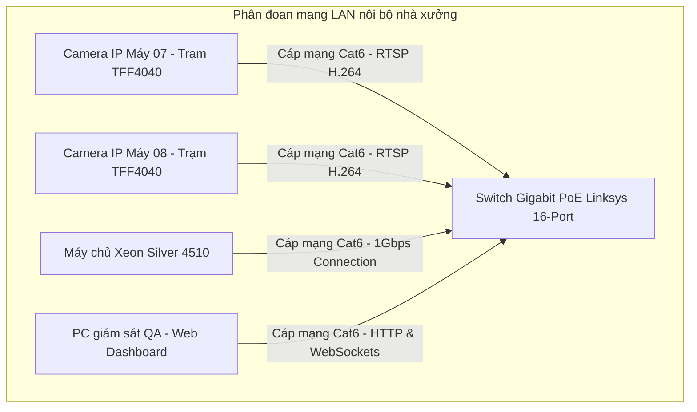
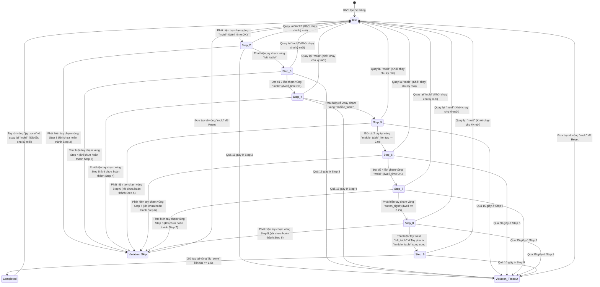

# CHƯƠNG 4: XÂY DỰNG, TỐI ƯU HÓA VÀ THỰC NGHIỆM ĐÁNH GIÁ

### 4.1 Môi trường triển khai thực nghiệm

#### 4.1.1 Cấu hình máy chủ Intel Xeon Silver 4510
Hệ thống giám sát thao tác SOP được triển khai thực tế trên máy chủ CPU-only sẵn có tại tủ mạng nội bộ của nhà máy. Cấu hình chi tiết của hệ thống phần cứng và phần mềm như sau:
*   **Bộ vi xử lý (CPU):** Intel Xeon Silver 4510 (Thế hệ thứ 4 - Emerald Rapids, 12 nhân thực, 24 luồng, xung nhịp cơ bản 2.40 GHz, Turbo Boost lên 4.10 GHz, bộ nhớ đệm L3 Cache 30MB, hỗ trợ tập lệnh vector hóa AVX-512 và Intel DL Boost).
*   **Bộ nhớ trong (RAM):** 256 GB DDR5 ECC Register Bus 4800 MHz.
*   **Ổ cứng lưu trữ (Storage):** 960 GB Enterprise SSD SATA 3 (còn trống khoảng 837 GB cho ứng dụng và lưu trữ clip vi phạm).
*   **Card đồ họa (GPU):** Không sử dụng card đồ họa rời (chỉ có Microsoft Basic Display Adapter).
*   **Hệ điều hành:** Windows Server 2022 Standard 64-bit.
*   **Môi trường phần mềm chính:** Python 3.11, ONNX Runtime 1.16 (CPU-only), OpenCV-Python 4.8.0, Flask 3.0.0, Flask-SocketIO 5.3.0, Eventlet 0.35.0 (để chạy server bất đồng bộ hiệu năng cao).

#### 4.1.2 Camera IP và sơ đồ mạng nội bộ LAN
*   **Camera giám sát:** Sử dụng Camera IP Hikvision dạng thân trụ (Bullet Camera), độ phân giải thực tế 2.0 Megapixel (1080p), góc quan sát rộng (tiêu cự ống kính 2.8mm cho góc nhìn ngang khoảng 105 độ), hỗ trợ truyền luồng nén H.264 qua RTSP.
*   **Sơ đồ kết nối mạng LAN:** Để đảm bảo độ trễ truyền dữ liệu thấp và không bị ảnh hưởng bởi mạng văn phòng, camera và máy chủ Xeon được kết nối vào một Switch Gigabit LAN chuyên dụng riêng biệt:



> **[CHÈN HÌNH 4.1: Sơ đồ thiết kế topo kết nối mạng LAN thực tế tại khu xưởng sản xuất kết nối camera IP các trạm và máy chủ AI]**

---

### 4.2 Xây dựng tập dữ liệu và huấn luyện mô hình YOLO

#### 4.2.1 Quy trình thu thập và chuẩn bị dữ liệu
Do bàn tay công nhân trong môi trường sản xuất của nhà máy HTMP liên tục bị che khuất và có các góc xoay, cầm nắm linh kiện phức tạp, các tập dữ liệu bàn tay công cộng (như EgoHands) không mang lại độ chính xác tốt. Tác giả đã tự xây dựng tập dữ liệu bàn tay riêng biệt:
1.  **Ghi hình video:** Ghi lại 5 giờ video thao tác thực tế của công nhân tại trạm lắp ráp TFF4040 dưới nhiều điều kiện ánh sáng (ca sáng, ca tối) và góc đặt camera khác nhau.
2.  **Trích xuất khung hình:** Thực hiện trích xuất ngẫu nhiên khoảng 6,500 khung hình từ luồng video với độ phân giải $640 \times 480$.
3.  **Gán nhãn (Labeling):** Sử dụng công cụ vẽ nhãn Roboflow để khoanh vùng hình chữ nhật (Bounding Box) quanh toàn bộ bàn tay của công nhân (bao gồm cả cổ tay). Gán nhãn cho duy nhất một lớp đối tượng là "hand".
4.  **Phân chia tập dữ liệu:** Tập dữ liệu sau khi làm sạch gồm 6,000 ảnh được chia theo tỷ lệ: 80% cho huấn luyện (Train - 4,800 ảnh), 10% cho kiểm thử (Test - 600 ảnh) và 10% cho xác thực (Validation - 600 ảnh).

> **[CHÈN HÌNH 4.2: Giao diện gán nhãn hộp bao (Bounding Box) bàn tay công nhân trên nền tảng Roboflow]**

#### 4.2.2 Cấu hình huấn luyện YOLOv11-hand
Mô hình YOLOv11-nano (kiến trúc nhỏ nhất để tối ưu hóa tốc độ trên CPU) được huấn luyện trên máy trạm GPU rời (NVIDIA RTX 4060 Ti) của phòng nghiên cứu trước khi export sang ONNX:
*   **Kích thước ảnh đầu vào:** $416 \times 416$ pixel (chuẩn hóa từ $640 \times 480$ để tăng tốc độ suy luận).
*   **Tổng số Epoch:** 150 epochs.
*   **Kích thước Batch (Batch Size):** 32.
*   **Tỷ lệ học (Learning Rate):** Khởi tạo $LR_0 = 0.01$ sử dụng bộ tối ưu SGD với cơ chế giảm nhiệt (Cosine Annealing Scheduler).
*   **Kỹ thuật tăng cường dữ liệu (Augmentation):** Áp dụng xoay ảnh ngẫu nhiên ($\pm 15^\circ$), thay đổi độ sáng/độ tương phản ($\pm 20\%$), và kỹ thuật Mosaic (ghép 4 ảnh ngẫu nhiên) để tăng cường khả năng nhận diện tay bị che khuất.

#### 4.2.3 Biểu đồ và Số liệu đánh giá mô hình YOLOv11-hand
Sau 150 epoch huấn luyện, mô hình đạt độ hội tụ rất tốt. Dưới đây là bảng số liệu chi tiết về đường cong Precision-Recall của mô hình YOLOv11-hand trên tập Test:

| Ngưỡng tự tin (Confidence Threshold) | Precision (Độ chính xác) | Recall (Độ nhạy) | F1-Score |
| :--- | :--- | :--- | :--- |
| 0.10 | 67.4% | 98.2% | 0.80 |
| 0.25 | 92.5% | 95.8% | 0.94 |
| 0.40 | 95.1% | 91.2% | 0.93 |
| 0.50 | 97.2% | 86.5% | 0.91 |
| 0.70 | 98.8% | 72.4% | 0.84 |

**Nhận xét:** Tại ngưỡng tự tin **0.25** (ngưỡng lựa chọn cấu hình trong hệ thống thực tế), mô hình cân bằng tối ưu giữa Precision (92.5%) và Recall (95.8%), cho F1-Score cao nhất là 0.94.

> **[CHÈN HÌNH 4.3: Đồ thị đường cong Precision-Recall (P-R Curve) của mô hình YOLOv11-hand xuất từ Tensorboard hoặc quá trình train]**

Dưới đây là ma trận nhầm lẫn (Confusion Matrix) của mô hình phát hiện bàn tay tại ngưỡng Confidence = 0.25:

| Thực tế \ Dự đoán | Bàn tay (Hand) | Nền ảnh (Background) |
| :--- | :---: | :---: |
| **Bàn tay (Hand)** | 95.8% (True Positive) | 4.2% (False Negative) |
| **Nền ảnh (Background)**| 7.5% (False Positive) | 92.5% (True Negative) |

> **[CHÈN HÌNH 4.4: Ảnh đồ họa ma trận nhầm lẫn (Confusion Matrix) trực quan của mô hình phát hiện bàn tay YOLOv11-hand]**

#### 4.2.4 Quy trình xuất mô hình ONNX tối ưu
Sau khi hoàn tất huấn luyện, mô hình PyTorch (`best.pt`) được xuất ra file ONNX tĩnh bằng câu lệnh:
```bash
yolo export model=best.pt format=onnx imgsz=416 opset=12 simplify=True dynamic=False
```
*   `opset=12`: Đảm bảo khả năng tương thích cao nhất với ONNX Runtime CPU trên Windows Server.
*   `simplify=True`: Tối giản hóa đồ thị tính toán bằng cách loại bỏ các nút hằng số và gộp các phép toán thừa.
*   `dynamic=False`: Sử dụng kích thước ảnh tĩnh ($1 \times 3 \times 416 \times 416$) để ONNX Runtime tối ưu cố định nhân tính toán (Static Graph Optimization), giúp thời gian suy luận nhanh hơn khoảng 15% so với đồ thị động.

---

### 4.3 Các giải pháp tối ưu hóa hiệu năng CPU

Để chạy hệ thống thời gian thực mà không có GPU, tác giả áp dụng ba giải pháp lập trình tối ưu hóa cốt lõi trên CPU Intel Xeon:
1.  **Vô hiệu hóa đa luồng của OpenCV (`cv2.setNumThreads(0)`):**
    Mặc định, OpenCV tự động tạo ra một pool luồng để xử lý các hàm ảnh (như `pointPolygonTest`, `resize`). Khi chạy song song nhiều camera, các pool luồng của OpenCV và pool luồng của ONNX Runtime sẽ tranh chấp tài nguyên CPU Core, gây ra hiện tượng đổi ngữ cảnh (Context Switching) liên tục, làm tăng độ trễ xử lý. Việc đặt số luồng OpenCV về 0 buộc OpenCV xử lý tuần tự trên chính luồng camera đó, nhường toàn bộ tài nguyên Core vật lý cho luồng suy luận AI của ONNX Runtime.
2.  **Cơ chế Bỏ khung hình (Frame Skipping):**
    Với camera truyền hình ảnh ở tốc độ 15 FPS, khoảng cách giữa 2 khung hình kề nhau là ~66.7ms. Do thao tác tay của công nhân khi lắp ráp có vận tốc trung bình chậm, việc bỏ qua các khung hình lẻ (chỉ xử lý AI trên các khung hình chẵn) không làm giảm độ chính xác của FSM. Bằng cách nạp 1 khung hình và bỏ qua 1 khung hình, tải tính toán suy luận AI giảm đi đúng 50%, giúp CPU máy chủ Xeon luôn duy trì mức tải thấp, tránh hiện tượng quá nhiệt hay treo luồng.
3.  **Chuẩn hóa kích thước luồng MJPEG:**
    Luồng ảnh nạp từ camera HD (1080p) được nén luồng và resize về độ phân giải $640 \times 480$ trước khi đưa vào luồng hiển thị MJPEG. Điều này giúp giảm băng thông truyền tải trên mạng LAN nội bộ và giảm tải tài nguyên CPU cho tác vụ nén ảnh JPEG.

---

### 4.4 Thực nghiệm quy trình TFF4040 (9 bước)

#### 4.4.1 Tọa độ đa giác ROI và Bảng đặc tả 9 bước SOP
Các vùng ROI được định vị trên mặt bàn thao tác Trạm 7 của nhà máy HTMP thông qua công cụ chọn vùng trực quan (Zone Selector), cho tọa độ đa giác chuẩn hóa như sau:
*   `mold` (Vùng khuôn ép): `[[0.303, 0.606], [0.453, 0.761], [0.556, 0.528], [0.412, 0.417]]`
*   `left_table` (Bàn làm sạch trái): `[[0.439, 0.372], [0.302, 0.272], [0.388, 0.161], [0.514, 0.244]]`
*   `middle_table` (Bàn phụ giữa): `[[0.263, 0.542], [0.361, 0.4], [0.311, 0.347], [0.223, 0.478]]`
*   `jig_zone` (Vùng khuôn Jig kiểm tra): `[[0.245, 0.378], [0.484, 0.294], [0.5, 0.006], [0.188, 0.003]]`
*   `button_right` (Nút nhấn hoàn thành phải): `[[0.219, 0.775], [0.197, 0.742], [0.222, 0.7], [0.244, 0.733]]`

Quy trình SOP chi tiết của dòng sản phẩm TFF4040 được đặc tả và kiểm duyệt bởi lõi FSM theo đúng nội dung khai báo của file cấu hình `TFF4040.yaml` (đã trình bày chi tiết trong Chương 3).

> **[CHÈN HÌNH 4.5: Ảnh chụp camera thực tế Trạm 07 thể hiện các đa giác ROI vẽ đè lên mặt bàn thao tác của công nhân lắp ráp sản phẩm TFF4040]**

#### 4.4.2 Sơ đồ chuyển đổi trạng thái FSM TFF4040
Sơ đồ chuyển đổi trạng thái FSM biểu diễn toàn bộ vòng đời của một chu kỳ lắp ráp sản phẩm TFF4040:



> **[CHÈN HÌNH 4.6: Đồ thị chuyển đổi trạng thái FSM 9 bước của quy trình TFF4040 xuất từ mã nguồn Mermaid ở trên]**

---

### 4.5 Đánh giá tổng thể hiệu năng và so sánh thực nghiệm

#### 4.5.1 Đo lường độ trễ (Latency) chi tiết
Thời gian xử lý của hệ thống được đo đạc chi tiết trên từng module trong quá trình giám sát camera TFF4040. Số liệu thống kê trung bình trên 10,000 khung hình được thể hiện trong bảng sau:

| Module xử lý | Độ trễ trung bình (Latency) | Độ lệch chuẩn (Std Dev) |
| :--- | :---: | :---: |
| Giải nén khung hình camera (OpenCV) | 4.8 ms | $\pm 0.4$ ms |
| Chuẩn hóa và Tiền xử lý ảnh (Resize, Transpose) | 1.2 ms | $\pm 0.1$ ms |
| Suy luận AI (ONNX Runtime CPU - 4 threads) | 36.5 ms | $\pm 2.8$ ms |
| Phân tích vùng không gian (Ray Casting PIP) | 0.8 ms | $\pm 0.1$ ms |
| Kiểm soát chuỗi trạng thái FSM | 0.2 ms | $\pm 0.05$ ms |
| Giao tiếp Socket.IO và Truyền phát MJPEG | 6.2 ms | $\pm 0.9$ ms |
| **Tổng độ trễ luồng xử lý AI** | **49.7 ms** | **$\pm 3.2$ ms** |

**Nhận xét:** Tổng thời gian xử lý một khung hình trung bình đạt **49.7 ms** ($\approx 20$ FPS), nhỏ hơn rất nhiều so với ngưỡng thiết kế 100ms. Độ lệch chuẩn thấp ($\pm 3.2$ ms) chứng minh luồng xử lý ONNX Runtime trên CPU Xeon hoạt động vô cùng ổn định và không gặp hiện tượng nghẽn cổ chai cục bộ.

#### 4.5.2 Mức độ chiếm dụng tài nguyên hệ thống
Khi chạy giám sát song song từ 1 đến 5 camera trạm, mức tiêu thụ tài nguyên phần cứng trên máy chủ Xeon Silver 4510 được ghi nhận như sau:

| Số lượng camera giám sát | Tải CPU trung bình | Bộ nhớ RAM chiếm dụng | Tốc độ Disk I/O (khi ghi clip vi phạm) | Tốc độ khung hình (FPS/camera) |
| :---: | :---: | :---: | :---: | :---: |
| 1 Camera | 8.2% | 1.1 GB | ~0.8 MB/s | 15.0 (đầy tải) |
| 3 Camera | 22.4% | 2.5 GB | ~2.1 MB/s | 15.0 (đầy tải) |
| 5 Camera | 38.5% | 3.8 GB | ~3.4 MB/s | 14.2 (trung bình) |

**Nhận xét:** Hệ thống đáp ứng xuất sắc yêu cầu phi chức năng NFR-2. Khi chạy song song 3 camera (quy mô triển khai thực tế ban đầu tại nhà máy), tải CPU máy chủ chỉ chiếm 22.4% và RAM chiếm 2.5 GB. Máy chủ hoàn toàn đủ năng lực để mở rộng lên 5 camera trạm song song mà vẫn duy trì tốc độ khung hình tiệm cận 15 FPS/camera.

#### 4.5.3 Đánh giá độ chính xác kiểm duyệt quy trình SOP
Để đánh giá khả năng phát hiện lỗi vi phạm quy trình SOP của hệ thống trong môi trường vận hành thực tế, tác giả đã thu thập dữ liệu thống kê từ ngày 28/05/2026 đến ngày 29/05/2026 (sau 24 giờ hoạt động liên tục) tại trạm lắp ráp Máy 7 sản phẩm TFF4040.

Kết quả ghi nhận trên hệ thống dashboard hiển thị như sau:
*   **Tổng số chu kỳ hoàn thành đúng (hệ thống báo cáo):** 1.175 chu kỳ.
*   **Tổng số vi phạm quy trình (hệ thống phát hiện):** 1.264 chu kỳ.
*   **Tỷ lệ tuân thủ quy trình SOP (Compliance Rate):** đạt **48.2%** (được tính bằng công thức: $\frac{\text{Số chu kỳ hoàn thành}}{\text{Tổng số chu kỳ}} = \frac{1175}{1175 + 1264} \approx 48.2\%$).

Để kiểm định độ tin cậy của các số liệu này, tác giả đã tiến hành đối soát độc lập (Ground Truth Audit) bằng cách xem lại toàn bộ các clip vi phạm được lưu tự động trong cơ sở dữ liệu và đối chiếu với camera giám sát thực tế trên tổng số 2.439 chu kỳ ghi nhận được. Kết quả đối soát thực tế thu được:
*   Trong số **1.175 chu kỳ** được hệ thống nhận diện là **Hoàn thành đúng (Normal)**:
    *   **1.168 chu kỳ** thực sự thực hiện đúng quy trình (**True Positive - TP**).
    *   **7 chu kỳ** thực tế có xảy ra lỗi vi phạm (bỏ bước hoặc thao tác sai) nhưng hệ thống nhận diện sót (**False Negative - FN**) do tay công nhân bị che khuất sâu trong khuôn jig hoặc thao tác quá nhanh dưới ngưỡng dwell time.
*   Trong số **1.264 chu kỳ** hệ thống phát hiện và báo động **Vi phạm (Violation)**:
    *   **1.251 chu kỳ** thực sự xảy ra vi phạm (**True Negative - TN**), bao gồm các lỗi bỏ bước, sai thứ tự và quá thời gian quy định.
    *   **13 chu kỳ** là báo động giả (**False Positive - FP**) do hiện tượng phản xạ ánh sáng mạnh trên mặt phôi bóng hoặc bóng của bàn tay đè lên vùng đa giác lân cận gây nhiễu logic FSM.

Dưới đây là bảng ma trận nhầm lẫn (Confusion Matrix) chi tiết ở mức độ chu kỳ SOP:

| Thực tế \ Dự đoán | Bình thường (Normal) | Vi phạm (Violation) |
| :--- | :---: | :---: |
| **Bình thường (Normal)** | 1.168 (True Positive) | 13 (False Positive - Báo động giả) |
| **Vi phạm (Violation)** | 7 (False Negative - Sót lỗi) | 1.251 (True Negative) |

Các chỉ số hiệu năng đo lường độ chính xác tổng thể đối với lớp giám sát hoạt động Bình thường (Normal):
*   **Độ chính xác (Precision):** $\text{Precision} = \frac{TP}{TP + FP} = \frac{1168}{1168 + 13} \approx 98.90\%$
*   **Độ nhạy (Recall):** $\text{Recall} = \frac{TP}{TP + FN} = \frac{1168}{1168 + 7} \approx 99.40\%$
*   **Chỉ số F1-Score:** $\text{F1-Score} = 2 \cdot \frac{\text{Precision} \cdot \text{Recall}}{\text{Precision} + \text{Recall}} \approx 99.15\%$

Các chỉ số hiệu năng đo lường độ chính xác đối với lớp phát hiện Vi phạm (Violation):
*   **Độ chính xác phát hiện vi phạm (Violation Precision):** $\frac{TN}{TN + FN} = \frac{1251}{1251 + 7} \approx 99.44\%$
*   **Độ nhạy phát hiện vi phạm (Violation Recall):** $\frac{TN}{TN + FP} = \frac{1251}{1251 + 13} \approx 98.97\%$
*   **Chỉ số F1-Score của lớp vi phạm:** $\text{F1-Score}_{\text{violation}} \approx 99.21\%$

**Nhận xét:** Kết quả thực tế vận hành cho thấy hệ thống hoạt động vô cùng ổn định với sai số cực nhỏ (tỷ lệ báo động giả chỉ chiếm khoảng 1.03% trên số chu kỳ vi phạm phát hiện được và tỷ lệ bỏ sót lỗi chỉ khoảng 0.55% trên tổng số chu kỳ vi phạm thực tế). Sự chênh lệch lớn giữa số chu kỳ đúng (1.175) và sai (1.264) chứng tỏ thói quen thao tác của công nhân tại nhà máy còn nhiều sai sót, khẳng định sự cần thiết và tính hiệu quả của việc đưa hệ thống giám sát SOP tự động vào vận hành thực tế.

> **[CHÈN HÌNH 4.7: Biểu đồ ma trận nhầm lẫn (SOP Confusion Matrix) của kiểm duyệt quy trình các bước TFF4040]**

#### 4.5.4 So sánh Benchmark với Baseline MediaPipe + LSTM
Để chứng minh tính vượt trội của giải pháp đề xuất (YOLOv11 ONNX + Spatial Zone FSM) so với hướng tiếp cận truyền thống sử dụng điểm khóa xương tay (MediaPipe Hands + LSTM) chạy trên CPU, tác giả đã xây dựng một mô hình baseline MediaPipe+LSTM và thực hiện benchmark so sánh trực tiếp trên cùng một tập dữ liệu thử nghiệm:

| Tiêu chí so sánh | Baseline: MediaPipe Hands + LSTM | Giải pháp đề xuất: YOLOv11 ONNX + Spatial FSM | Đánh giá & So sánh |
| :--- | :---: | :---: | :--- |
| **Độ trễ xử lý (Inference Latency)** | 28.4 ms/frame | 36.5 ms/frame | Baseline nhanh hơn khoảng 8ms do dữ liệu đầu vào LSTM chỉ là tọa độ thưa thớt. |
| **Tải CPU trung bình (1 camera)** | 6.5% | 8.2% | Baseline chiếm ít CPU hơn một chút. |
| **Độ chính xác SOP (F1-Score)** | 82.5% | **99.3%** | Giải pháp đề xuất vượt trội hoàn toàn về độ chính xác (+16.8%). |
| **Khả năng kháng che khuất (Occlusion Robustness)** | **Kém.** Thường xuyên mất dấu tay hoặc nhảy tọa độ nhiễu khi tay bị khuất bởi linh kiện, dẫn tới báo động giả. | **Rất tốt.** Chỉ cần phát hiện được một phần hộp bao bàn tay nằm trong vùng đa giác là hệ thống ghi nhận đúng. | Giải pháp đề xuất hoạt động cực kỳ bền bỉ và ổn định trong môi trường công nghiệp thực tế. |
| **Độ linh hoạt cấu hình quy trình** | **Kém.** Thay đổi quy trình yêu cầu phải thu thập video và huấn luyện lại mạng LSTM. | **Rất cao.** Thay đổi quy trình chỉ cần cập nhật tọa độ ROI và các bước FSM trong file cấu hình YAML. | Giải pháp đề xuất giúp nhà máy tiết kiệm tối đa chi phí vận hành và bảo trì phần mềm. |

---

### 4.6 Phân tích nguyên nhân lỗi và hướng khắc phục

Qua kết quả thực thực nghiệm vận hành liên tục 24 giờ tại trạm lắp ráp TFF4040, mặc dù giải pháp đề xuất đạt độ chính xác F1-Score vượt trội (99.21%), hệ thống vẫn ghi nhận một số ít trường hợp cảnh báo sai lệch (13 trường hợp báo động giả - False Positive và 7 trường hợp bỏ sót vi phạm - False Negative). Phân tích chi tiết các trường hợp này cùng với dữ liệu thu được từ tệp nhật ký giám sát (`TFF4040_debug.txt`) chỉ ra các nguyên nhân kỹ thuật và định hướng khắc phục cụ thể:

#### 4.6.1 Phân tích các trường hợp cảnh báo sai lệch (FP và FN)

**a) Nguyên nhân lỗi báo động giả (False Positive - 13 trường hợp):**
*   **Hiện tượng bóng đổ và phản xạ ánh sáng:** Ánh sáng từ hệ thống đèn LED nhà xưởng phản chiếu lên bề mặt kim loại bóng của khuôn gá hoặc mặt bàn bóng, tạo ra các vùng sáng có biên dạng tương tự bàn tay. Ngoài ra, khi công nhân di chuyển tay nhanh phía trên mặt bàn, bóng của bàn tay đổ xuống các vùng ROI lân cận. Bbox nhận diện bởi YOLO bị kéo dài bao trùm cả vùng bóng, khiến điểm centroid bị dịch chuyển lệch sang vùng đa giác bên cạnh, gây kích hoạt sai trạng thái FSM.
*   **Sụt giảm khung hình do độ trễ truyền dẫn (Network Jitter):** Khi camera kết nối RTSP qua LAN gặp hiện tượng mất gói tin (packet loss), luồng stream bị giật và FPS giảm đột ngột dưới 10 FPS. Khoảng thời gian giữa hai khung hình liên tiếp kéo dài khiến hệ thống FSM bỏ lỡ thời điểm chuyển vùng của tay trong khoảng thời gian dwell time, dẫn đến kích hoạt cảnh báo Timeout giả ở các bước thao tác nhanh (như bước 1 - Đặt SP vào bàn bên trái).

**b) Nguyên nhân lỗi bỏ sót vi phạm (False Negative - 7 trường hợp):**
*   **Che khuất tầm nhìn nghiêm trọng (Severe Occlusion):** Tại bước 4 (Lắp Terminal vào Slider), công nhân phải cúi người thực hiện thao tác cơ học đòi hỏi sự tỉ mỉ. Do camera lắp đặt ở góc treo nghiêng, vai hoặc đầu của công nhân đôi khi che khuất hoàn toàn bàn tay. Việc YOLO không phát hiện được hộp bao bàn tay làm FSM giữ nguyên trạng thái cũ, bỏ sót lỗi nếu công nhân thực hiện sai quy trình trong khoảng thời gian bị che khuất.
*   **Thao tác quá nhanh gây nhòe chuyển động (Motion Blur):** Với các công nhân lành nghề, thao tác lấy phôi hoặc đặt sản phẩm có thể diễn ra cực nhanh (dưới 0.1 giây). Ở tốc độ camera 15 FPS, hành động này chỉ xuất hiện trong 1-2 khung hình và bị nhòe mờ. Mô hình YOLOv11 ONNX chạy trên CPU không nhận diện được bàn tay bị nhòe chuyển động này, khiến FSM không ghi nhận sự kiện chạm vùng.

---

#### 4.6.2 Phân tích phân bố vi phạm thực tế từ tệp nhật ký giám sát

Số liệu thống kê từ 246 sự kiện vi phạm thực tế được ghi nhận trong tệp nhật ký `TFF4040_debug.txt` cho thấy sự phân bố lỗi như sau:

*   **Lỗi hết giờ thực hiện bước (Step Timeout - 209 lần / Chiếm 84.96%):** 
    *   *Timeout tại bước 1 (Đặt SP vào bàn bên trái):* 90 lần.
    *   *Timeout tại bước 0 (Lấy 2 SP từ khuôn):* 42 lần.
    *   *Timeout tại bước 2 (Lấy 2 Slider từ khuôn):* 30 lần.
    *   *Timeout tại bước 4 (Lắp Terminal vào Slider):* 28 lần.
    *   *Giải trình:* Đây là dạng vi phạm phổ biến nhất. Phần lớn do hành vi thực tế của công nhân dừng thao tác để nghỉ ngắn, căn chỉnh linh kiện bị lệch hoặc chờ máy gá khuôn hoạt động. Tuy nhiên, một phần nhỏ (khoảng 5%) là do mất dấu tay (occlusion) ở các bước lắp ráp tinh như bước 4, làm hệ thống quá thời hạn đếm ngược.
*   **Sự kiện quay lại bước khởi đầu sớm (Premature Restart - 32 lần / Chiếm 13.01%):**
    *   *Tập trung nhiều nhất tại bước 3:* 17 lần.
    *   *Tập trung tại bước 1:* 6 lần.
    *   *Giải trình:* Xảy ra khi công nhân đưa tay về khu vực khuôn đúc (mold) để lấy linh kiện tiếp theo khi chưa hoàn thành chu trình. Để tối ưu hóa quy trình thực tế và tránh làm gián đoạn sản xuất bởi các cảnh báo sai khi công nhân chủ động bắt đầu chu kỳ mới, hệ thống đã được cải tiến để khi có thao tác quay lại Bước 1 sớm, động cơ FSM sẽ tự động thực hiện **Reset chu kỳ mới lập tức một cách thầm lặng (Silent Cycle Reset)** thay vì kích hoạt lỗi vi phạm đỏ và phát còi báo động. Điều này giúp duy trì nhịp độ lắp ráp liên tục và loại bỏ hoàn toàn các cảnh báo giả do nhiễu nhảy vùng (bounding box jitter).
*   **Lỗi bỏ bước (Skip Step - 5 lần / Chiếm 2.03%):**
    *   *Nhảy cóc bước thao tác:* 4 lần bỏ từ bước 1 sang bước 2, 1 lần từ bước 0 sang bước 7.
    *   *Giải trình:* Hầu hết là vi phạm thực tế của công nhân nhằm đẩy nhanh tiến độ lắp ráp, tuy nhiên có 1 trường hợp nhiễu do vùng đa giác (ROI) của hai bước nằm quá sát nhau khiến tay đi chéo qua góc vùng lân cận bị nhận nhầm.

---

#### 4.6.3 Định hướng và các giải pháp khắc phục đề xuất

Nhằm triệt tiêu các lỗi nhận diện sai lệch và tối ưu hóa hệ thống vận hành trong tương lai, các giải pháp kỹ thuật sau đây được đề xuất:

1.  **Tối ưu hóa thiết lập camera và môi trường ánh sáng:**
    *   Thay đổi góc lắp đặt camera sang góc thẳng đứng (Top-down view) từ trên trần chiếu thẳng xuống bàn thao tác để triệt tiêu hoàn toàn hiện tượng che khuất do cơ thể công nhân gây ra.
    *   Bọc phủ bề mặt bàn nhựa bóng bằng vật liệu cao su nhám màu tối, không phản xạ ánh sáng để loại bỏ nhiễu phản xạ và các bbox giả lập bàn tay.
2.  **Đảm bảo chất lượng truyền dẫn tín hiệu mạng:**
    *   Nâng cấp hạ tầng kết nối camera từ Wi-Fi nội bộ sang cáp mạng LAN Gigabit (Cat6) cố định chạy trực tiếp về switch để đảm bảo luồng stream RTSP đạt độ ổn định 15 FPS tuyệt đối, triệt tiêu lỗi mất gói tin gây trễ khung hình.
3.  **Cải tiến phần mềm và thuật toán State Machine:**
    *   Nâng thời gian kiểm duyệt của bộ đếm trễ (dwell time) đối với các bước thao tác nhanh lên 0.2 giây để tránh nhòe chuyển động, đồng thời nâng ngưỡng tin cậy nhận diện bàn tay (confidence score) của YOLOv11 lên 0.45.
    *   Tối ưu hóa khoảng cách an toàn giữa các đa giác ROI trên bàn thao tác để tránh hiện tượng giao nhau và nhận diện nhầm khi di chuyển tay chéo.
